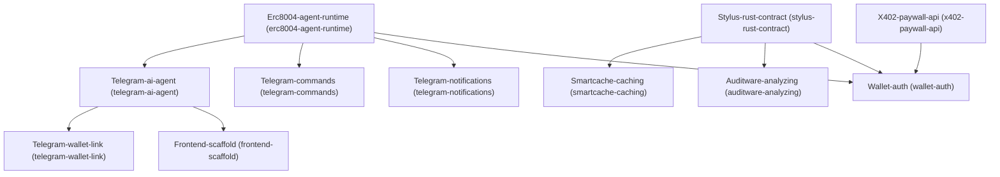

# Architecture

## Dependency Graph

## Execution / Implementation Order

1. **Erc8004-agent-runtime** (`f6c87779`)
2. **X402-paywall-api** (`a9607aeb`)
3. **Stylus-rust-contract** (`16583eb3`)
4. **Telegram-ai-agent** (`4e67462e`)
5. **Telegram-commands** (`7d720c6b`)
6. **Telegram-notifications** (`19750eca`)
7. **Smartcache-caching** (`8d16aec4`)
8. **Auditware-analyzing** (`c9dd0db7`)
9. **Wallet-auth** (`0e08cbcf`)
10. **Telegram-wallet-link** (`0f18fc06`)
11. **Frontend-scaffold** (`17c62909`)
