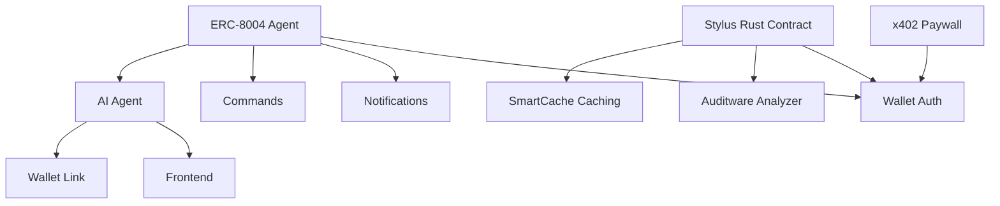

# My Dapp

> A Web3 application - composed with [N]skills

**Network**: Arbitrum Sepolia (Chain ID: 421614) — Testnet
**Keywords**: web3, dapp

---

## Architecture

## Components

| Component | Type | Category | User Prompt |
|-----------|------|----------|-------------|
| ERC-8004 Agent | `erc8004-agent-runtime` | agents | (none) |
| x402 Paywall | `x402-paywall-api` | payments | (none) |
| Stylus Rust Contract | `stylus-rust-contract` | contracts | (none) |
| AI Agent | `telegram-ai-agent` | telegram | (none) |
| Commands | `telegram-commands` | telegram | (none) |
| Notifications | `telegram-notifications` | telegram | (none) |
| SmartCache Caching | `smartcache-caching` | contracts | (none) |
| Auditware Analyzer | `auditware-analyzing` | contracts | (none) |
| Wallet Auth | `wallet-auth` | app | (none) |
| Wallet Link | `telegram-wallet-link` | telegram | (none) |
| Frontend | `frontend-scaffold` | app | (none) |

## Implementation Order

Build the project in this order (respects dependencies):

1. **ERC-8004 Agent** (`erc8004-agent-runtime`) — see `.cradle/components/erc8004-agent-runtime--f6c87779.md`
2. **x402 Paywall** (`x402-paywall-api`) — see `.cradle/components/x402-paywall-api--a9607aeb.md`
3. **Stylus Rust Contract** (`stylus-rust-contract`) — see `.cradle/components/stylus-rust-contract--16583eb3.md`
4. **AI Agent** (`telegram-ai-agent`) — see `.cradle/components/telegram-ai-agent--4e67462e.md`
5. **Commands** (`telegram-commands`) — see `.cradle/components/telegram-commands--7d720c6b.md`
6. **Notifications** (`telegram-notifications`) — see `.cradle/components/telegram-notifications--19750eca.md`
7. **SmartCache Caching** (`smartcache-caching`) — see `.cradle/components/smartcache-caching--8d16aec4.md`
8. **Auditware Analyzer** (`auditware-analyzing`) — see `.cradle/components/auditware-analyzing--c9dd0db7.md`
9. **Wallet Auth** (`wallet-auth`) — see `.cradle/components/wallet-auth--0e08cbcf.md`
10. **Wallet Link** (`telegram-wallet-link`) — see `.cradle/components/telegram-wallet-link--0f18fc06.md`
11. **Frontend** (`frontend-scaffold`) — see `.cradle/components/frontend-scaffold--17c62909.md`

## Environment Variables

| Key | Description | Required | Default |
|-----|-------------|----------|---------|
| `AGENT_NAME` | Name of the AI agent | Yes | MyAgent |
| `OPENROUTER_API_KEY` | OpenRouter API key for LLM access | Yes |  |
| `OPENROUTER_MODEL` | Model to use via OpenRouter | No | openai/gpt-4o |
| `NEXT_PUBLIC_AGENT_REGISTRY_ADDRESS` | ERC-8004 registry contract address | No |  |
| `AGENT_PRIVATE_KEY` | Agent wallet private key for registry operations | No |  |
| `NEXT_PUBLIC_AGENT_NETWORK` | Network for agent operations (arbitrum or arbitrum-sepolia) | Yes | arbitrum |
| `PAYMENT_RECEIVER_ADDRESS` | Ethereum address to receive payments | Yes |  |
| `PAYMENT_PRIVATE_KEY` | Private key for signing receipts | Yes |  |
| `STYLUS_RPC_URL` | Arbitrum RPC URL for deployment | Yes | https://sepolia-rollup.arbitrum.io/rpc |
| `DEPLOYER_PRIVATE_KEY` | Private key for deployment | Yes |  |
| `TELEGRAM_BOT_TOKEN` | Bot token from @BotFather | Yes |  |
| `OPENAI_API_KEY` | API key for OpenAI | Yes |  |
| `TELEGRAM_WEBHOOK_SECRET` | Secret for webhook verification | Yes |  |
| `NEXT_PUBLIC_WALLETCONNECT_PROJECT_ID` | WalletConnect Cloud project ID | Yes |  |
| `NEXT_PUBLIC_APP_NAME` | Application name for wallet dialogs | No | My DApp |
| `NEXT_PUBLIC_TELEGRAM_BOT_USERNAME` | Your bot username (without @) | Yes |  |

## Key Dependencies

| Package | Version |
|---------|---------|
| `next` | `^14.2.0` |
| `react` | `^18.3.0` |
| `react-dom` | `^18.3.0` |
| `wagmi` | `^2.12.0` |
| `viem` | `^2.21.0` |
| `@tanstack/react-query` | `^5.51.0` |
| `@rainbow-me/rainbowkit` | `^2.1.0` |
| `clsx` | `^2.1.0` |
| `tailwind-merge` | `^2.2.0` |
| `ethers` | `^6.13.0` |
| `lucide-react` | `^0.400.0` |
| `@types/node` | `^20.0.0` |
| `@types/react` | `^18.3.0` |
| `@types/react-dom` | `^18.3.0` |
| `typescript` | `^5.4.0` |
| `eslint` | `^8.57.0` |
| `eslint-config-next` | `^14.2.0` |
| `tailwindcss` | `^3.4.0` |
| `postcss` | `^8.4.0` |
| `autoprefixer` | `^10.4.0` |

## Detailed Component Specs

- [ERC-8004 Agent](.cradle/components/erc8004-agent-runtime--f6c87779.md)
- [x402 Paywall](.cradle/components/x402-paywall-api--a9607aeb.md)
- [Stylus Rust Contract](.cradle/components/stylus-rust-contract--16583eb3.md)
- [AI Agent](.cradle/components/telegram-ai-agent--4e67462e.md)
- [Commands](.cradle/components/telegram-commands--7d720c6b.md)
- [Notifications](.cradle/components/telegram-notifications--19750eca.md)
- [SmartCache Caching](.cradle/components/smartcache-caching--8d16aec4.md)
- [Auditware Analyzer](.cradle/components/auditware-analyzing--c9dd0db7.md)
- [Wallet Auth](.cradle/components/wallet-auth--0e08cbcf.md)
- [Wallet Link](.cradle/components/telegram-wallet-link--0f18fc06.md)
- [Frontend](.cradle/components/frontend-scaffold--17c62909.md)

## Additional Context

- [Project Configuration](.cradle/project.md)
- [Full Architecture Details](.cradle/architecture.md)
- [All Environment Variables](.cradle/environment.md)
- [Verified Dependencies](.cradle/dependencies.md)
- [Scripts Reference](.cradle/scripts.md)
- [Integration Map](.cradle/integration-map.md)

---

*Generated by [[N]skills](https://www.nskills.xyz) — Compose N skills for your Web3 project.*
